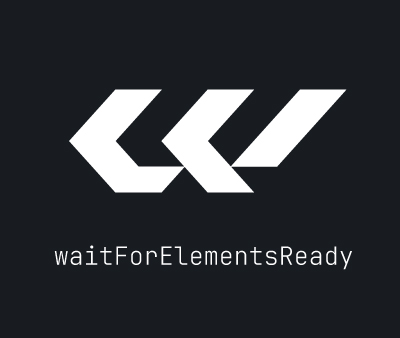

# waitForElementsReady

A zero-dependency orchestrator that waits until every custom element inside a target is defined and ready, then reveals the page by adding a CSS class, eliminating flash-of-unready-content without any component-level coordination code.

---

## Why waitForElementsReady ?

Custom elements connect and initialize asynchronously and at different speeds. Without coordination, the page appears in an intermediate state: some components are rendered while others still show their empty shell or a loading indicator.

The typical workaround — `setTimeout`, polling, or cascaded event listeners — is fragile and hard to maintain. `waitForElementsReady` provides a single, declarative solution:

- **Discovers automatically.** Scans the target for every hyphenated tag; no list to maintain.
- **Waits for real readiness.** Recognizes the `readyElement` contract (`el.ready` Promise), the `el.whenReady()` method, or falls back to `customElements.whenDefined()`.
- **CSS-driven reveal.** Adds a single class to the target when all elements are ready. Visibility is fully controlled by CSS — no JavaScript style mutations.
- **Mutation observer.** Optionally re-runs when new custom elements are injected after the initial scan.
- **Timeout safety.** Rejects with a clear error if any element takes too long, so a broken component never blocks the page forever.
- **`AbortController` support.** Disconnect the observer cleanly on SPA route changes or component teardown.

---

## Installation

### Package managers

```bash
npm install @nativelayer.dev/wait-for-elements-ready
```

```bash
pnpm add @nativelayer.dev/wait-for-elements-ready
```

```bash
yarn add @nativelayer.dev/wait-for-elements-ready
```

Then import the function:

```js
import { waitForElementsReady } from '@nativelayer.dev/wait-for-elements-ready'
```

### CDN

No install. Paste directly into HTML:

```html
<script type="module">
  import { waitForElementsReady } from 'https://cdn.jsdelivr.net/npm/@nativelayer.dev/wait-for-elements-ready/index.js'
  await waitForElementsReady()
</script>
```

---

## Usage

### Minimal setup

```html
<body>
  <site-header></site-header>
  <my-dashboard></my-dashboard>
</body>

<script type="module">
  import { waitForElementsReady } from '@nativelayer.dev/wait-for-elements-ready'
  await waitForElementsReady()
</script>
```

```css
body       { visibility: hidden; }
body.ready { visibility: visible; }
```

`document.body` is the default target. The `ready` class is added once every custom element inside it is defined and ready.

### Custom reveal class

```js
await waitForElementsReady(document.body, { revealClass: 'is-loaded' })
```

```css
body           { visibility: hidden; }
body.is-loaded { visibility: visible; }
```

### Scoped target

Reveal only a section of the page instead of the entire body:

```js
// pass a CSS selector
await waitForElementsReady('#app')

// or a direct reference
const app = document.getElementById('app')
await waitForElementsReady(app)
```

```css
#app       { visibility: hidden; }
#app.ready { visibility: visible; }
```

Only elements inside `#app` are tracked. Elements outside are ignored.

### Separate scan root and reveal target

Scan inside a container but add the reveal class to a parent element:

```js
await waitForElementsReady('#app', { reveal: document.body })
```

```css
body       { visibility: hidden; }
body.ready { visibility: visible; }
```

Useful when your custom elements live inside a shell container but the reveal should happen at a higher level.

---

## Readiness signals

`waitForElementsReady` recognizes three readiness patterns per element, checked in order:

| # | Signal | How |
|---|--------|-----|
| 1 | `el.ready` Promise | Awaited. The `readyElement` / `makeReady` contract. |
| 2 | `el.whenReady()` method | Called and its return value is awaited. |
| 3 | No signal | Element is considered ready as soon as `customElements.whenDefined()` resolves. |

The recommended pattern is `readyElement` or `makeReady` — they expose `el.ready` automatically.

---

## Options reference

| Option | Type | Default | Description |
|--------|------|---------|-------------|
| `revealClass` | `string` | `'ready'` | CSS class added to the reveal element when all elements are ready |
| `reveal` | `HTMLElement \| string` | `target` | Element that receives `revealClass`. Defaults to `target` |
| `timeout` | `number` | `4000` | Max ms to wait **per element** before the promise rejects |
| `observeMutations` | `boolean` | `true` | Watch for dynamically added custom elements after the initial scan |
| `signal` | `AbortSignal` | — | Disconnect the MutationObserver when aborted |
| `debug` | `boolean` | `false` | Log lifecycle steps to the console |

---

## Examples

### Waiting for the full page

```js
await waitForElementsReady(document.body)
// every custom element on the page is ready
```

```css
body       { visibility: hidden; }
body.ready { visibility: visible; }
```

### Progressive reveal — multiple zones

Reveal critical content immediately, let secondary content load independently:

```js
// critical zone — blocks until ready
await waitForElementsReady('#hero')

// sidebar — non-blocking, reveals when ready
waitForElementsReady('#sidebar').catch(() => {
  document.querySelector('#sidebar').classList.add('ready')
})
```

```css
#hero    { visibility: hidden; }
#hero.ready { visibility: visible; }

#sidebar { visibility: hidden; }
#sidebar.ready { visibility: visible; }
```

### Timeout safety

Prevent a single broken component from blocking the page indefinitely:

```js
waitForElementsReady(document.body, { timeout: 5000 })
  .catch(err => {
    // err.message: "Timeout waiting for MY-ELEMENT"
    console.warn(err)
    document.body.classList.add('ready') // reveal anyway
  })
```

The timeout applies **per element**. If any element takes longer than the configured limit, the promise rejects with the element's tag name in the message.

### Disconnecting the observer (SPA route changes)

```js
const controller = new AbortController()

await waitForElementsReady('#app', { signal: controller.signal })

// on route change or component unmount
controller.abort() // observer disconnects, no memory leak
```

### Disabling the observer for static pages

For pages with no dynamically injected elements, disable the observer to avoid unnecessary overhead:

```js
await waitForElementsReady(document.body, { observeMutations: false })
```

### Dynamically injected elements

When `observeMutations` is enabled (the default), the observer detects custom elements added at any depth after the initial scan:

```js
await waitForElementsReady('#app')

// later: inject a wrapper containing a custom element
const wrapper = document.createElement('div')
wrapper.innerHTML = '<data-chart></data-chart>'
document.querySelector('#app').appendChild(wrapper)
// observer detects <data-chart>, waits for it, re-adds the class
```

The observer detects custom elements at any depth, not only direct children.

### Debug mode

Log every lifecycle step to the console:

```js
await waitForElementsReady(document.body, { debug: true })
// [waitForElementsReady] root: <body>
// [waitForElementsReady] found 3 custom element(s): ['site-header', 'data-table', 'site-footer']
// [waitForElementsReady] waiting for ready Promise: <data-table>
// [waitForElementsReady] <site-header> ready
// [waitForElementsReady] <data-table> ready
// [waitForElementsReady] <site-footer> ready
// [waitForElementsReady] all ready
```

### Combined with `autoDefine`

Use `autoDefine` for registration, then `waitForElementsReady` for the reveal:

```js
import { autoDefine }           from '@nativelayer.dev/auto-define'
import { waitForElementsReady } from '@nativelayer.dev/wait-for-elements-ready'

await autoDefine({ path: '/components/' })
await waitForElementsReady(document.body, { timeout: 6000 })
```

### Targeting a Shadow Root

`waitForElementsReady` scans the **light DOM** only. To scan inside a shadow root, pass its reference directly:

```js
const host = document.querySelector('my-shell')
await host.ready

await waitForElementsReady(host.shadowRoot)
```

### No custom elements found

If the target contains no hyphenated elements, the promise resolves immediately and the class is added right away:

```js
// <div id="plain"><p>No custom elements here</p></div>
await waitForElementsReady('#plain')
// resolves instantly — #plain receives the ready class
```

### Handling target not found

If the selector does not match any element, the function throws synchronously before any async work begins:

```js
try {
  await waitForElementsReady('#does-not-exist')
} catch (err) {
  console.error(err.message) // "Target element not found"
}
```

---

## Anti-patterns

### ❌ Not hiding the page with CSS first

```js
await waitForElementsReady(document.body)
// class added — but the page was already visible the whole time
```

Without the corresponding CSS rule, the class is added but nothing is hidden during loading. FOUC still happens.

### ✅ Always pair with a CSS rule

```css
body       { visibility: hidden; }
body.ready { visibility: visible; }
```

```js
await waitForElementsReady(document.body)
```

---

### ❌ Ignoring the timeout rejection

```js
await waitForElementsReady(document.body)
// if a component never resolves, this line is never reached
// the page stays hidden forever
```

By default `timeout` is 4000 ms. If a broken component never calls `_resolveReady()`, the promise rejects — and if that rejection is unhandled, the page never reveals.

### ✅ Always handle the rejection

```js
waitForElementsReady(document.body, { timeout: 5000 })
  .catch(err => {
    console.warn('Reveal forced after timeout:', err.message)
    document.body.classList.add('ready')
  })
```

---

### ❌ Calling it inside a component

```js
class MyDashboard extends HTMLElement {
  async connectedCallback() {
    await waitForElementsReady(this) // wrong level of abstraction
    this.render()
  }
}
```

`waitForElementsReady` is a page-level orchestrator. Calling it inside a component mixes orchestration with initialization logic, and the mutation observer leaks unless manually aborted.

### ✅ Call it once at the entry point

```js
// main.js or index.html <script type="module">
await waitForElementsReady(document.body)
```

For per-component coordination, use `await child.ready` directly.

---

### ❌ Expecting it to scan inside Shadow DOM automatically

```js
class MyShell extends HTMLElement {
  connectedCallback() {
    this.attachShadow({ mode: 'open' })
    this.shadowRoot.innerHTML = `<data-chart></data-chart>`
  }
}

await waitForElementsReady(document.body)
// <data-chart> is inside a shadow root — it is NOT scanned
```

`querySelectorAll` does not pierce shadow roots. Elements inside shadow DOMs are invisible to the scanner.

### ✅ Scan the shadow root explicitly, or use `_resolveReady()` in the host

```js
class MyShell extends readyElement {
  async connectedCallback() {
    this.attachShadow({ mode: 'open' })
    this.shadowRoot.innerHTML = `<data-chart></data-chart>`
    const chart = this.shadowRoot.querySelector('data-chart')
    await chart.ready
    this._resolveReady() // host signals ready only after its shadow children are ready
  }
}
```

The host element becomes the single checkpoint. `waitForElementsReady` awaits `myShell.ready`, which itself waits for all shadow children.

---

### ❌ Relying on sequential readiness order

```js
await waitForElementsReady(document.body)
// don't assume site-header resolved before data-table
```

All elements are awaited in parallel via `Promise.all`. The order in which they resolve is not guaranteed.

### ✅ Use individual `ready` Promises if order matters

```js
const header = document.querySelector('site-header')
const table  = document.querySelector('data-table')

await header.ready
await table.ready  // runs after header, sequentially
```

---

## Edge cases

### Timeout is per element, not total

The `timeout` option applies to each element independently. With three elements and a 4000 ms timeout, the worst-case wait is 4000 ms — not 12 000 ms. All elements are awaited in parallel.

```js
// Three elements, all timing out at 4000 ms each — still only 4000 ms total
await waitForElementsReady(document.body, { timeout: 4000 })
```

If you need a hard total deadline, wrap the call in your own `Promise.race`:

```js
const deadline = new Promise((_, reject) =>
  setTimeout(() => reject(new Error('Page load timed out')), 8000)
)

await Promise.race([
  waitForElementsReady(document.body, { timeout: 4000 }),
  deadline,
])
```

---

### Already-defined elements incur no extra wait

If a custom element is already registered when the scan runs, `customElements.whenDefined()` resolves immediately on the next microtask. No polling, no delay.

```js
// define before calling
customElements.define('my-card', MyCard)

await waitForElementsReady(document.body)
// <my-card> definition resolves instantly — only its ready Promise is awaited
```

---

### Nested custom elements rendered dynamically

Elements rendered by a component's `connectedCallback` into its **light DOM** are not present in the DOM at scan time and will be missed by the initial pass.

```js
class MyDashboard extends HTMLElement {
  connectedCallback() {
    this.innerHTML = `<data-chart></data-chart>` // injected after initial scan
  }
}
```

`observeMutations: true` (the default) catches these — the observer fires when `<data-chart>` is appended, re-scans, and waits for it before re-adding the class.

To be explicit about it, ensure the host itself signals readiness only after its children are ready:

```js
class MyDashboard extends readyElement {
  async connectedCallback() {
    this.innerHTML = `<data-chart></data-chart>`
    const chart = this.querySelector('data-chart')
    await chart.ready
    this._resolveReady()
  }
}
```

---

### Shadow DOM is not scanned

`waitForElementsReady` uses `querySelectorAll('*')` which does not pierce shadow roots. Custom elements inside any shadow DOM — whether open or closed — are invisible to the scanner.

The idiomatic solution is to make the shadow host a `readyElement` that resolves only after all its shadow children are ready. The scanner then has a single, correct checkpoint per host.

---

### `observeMutations` triggers on every DOM mutation batch

The observer fires for any `childList` change inside the target, not only for custom elements. It checks whether any of the added nodes is (or contains) a custom element before re-running. If no custom elements are involved, the re-scan is skipped. High-frequency DOM mutations (e.g. a virtual list) can still produce overhead — disable the observer on those pages and manage readiness manually.

```js
await waitForElementsReady(document.body, { observeMutations: false })
```

---

### SSR / environments without `MutationObserver`

`waitForElementsReady` uses `MutationObserver` when `observeMutations` is `true`. In SSR or test environments that don't provide it, either disable mutations or polyfill before importing:

```js
if (typeof MutationObserver === 'undefined') {
  globalThis.MutationObserver = class {
    observe() {}
    disconnect() {}
  }
}
```

Or simply opt out:

```js
await waitForElementsReady(document.body, { observeMutations: false })
```

---

## Companion utilities

`waitForElementsReady` is the page-level orchestrator. It works best alongside two complementary utilities.

### `readyElement` — the readiness contract

The base class that gives each component an `el.ready` Promise. Without it, `waitForElementsReady` can only fall back to `customElements.whenDefined()`, which signals class registration — not instance readiness.

```js
import { readyElement } from '@nativelayer.dev/ready-element'

class MyWidget extends readyElement {
  async connectedCallback() {
    await this.fetchData()
    this._resolveReady()
  }
}
```

### `makeReady` — retrofit any class

When you can't extend `readyElement` (third-party elements, generated code), use `makeReady` to inject the same contract via prototype injection.

```js
import { makeReady } from '@nativelayer.dev/make-ready'
import ThirdPartyCarousel from '/vendor/carousel.js'

makeReady(ThirdPartyCarousel)
ThirdPartyCarousel.readyEvent = 'carousel-ready'
customElements.define('third-party-carousel', ThirdPartyCarousel)

// waitForElementsReady now sees el.ready on <third-party-carousel>
await waitForElementsReady(document.body)
```

---

## License

MIT.
See [LICENSE](./LICENSE) for the full text.
